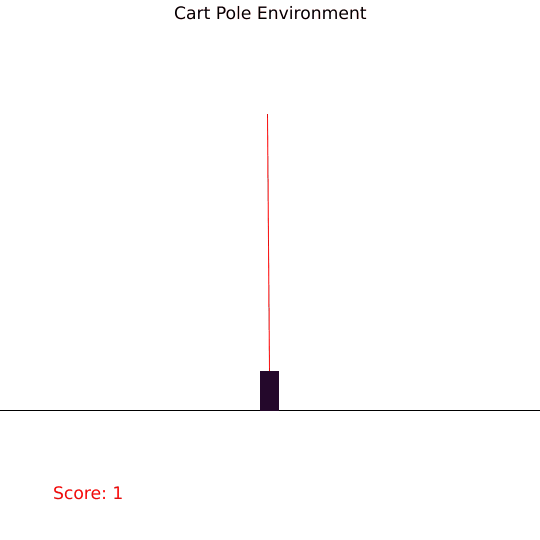
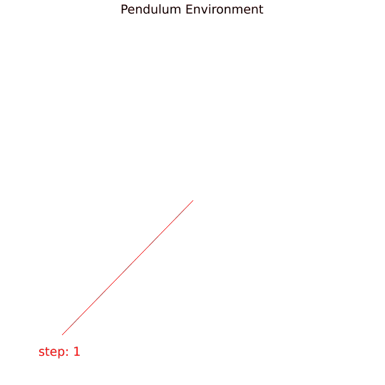
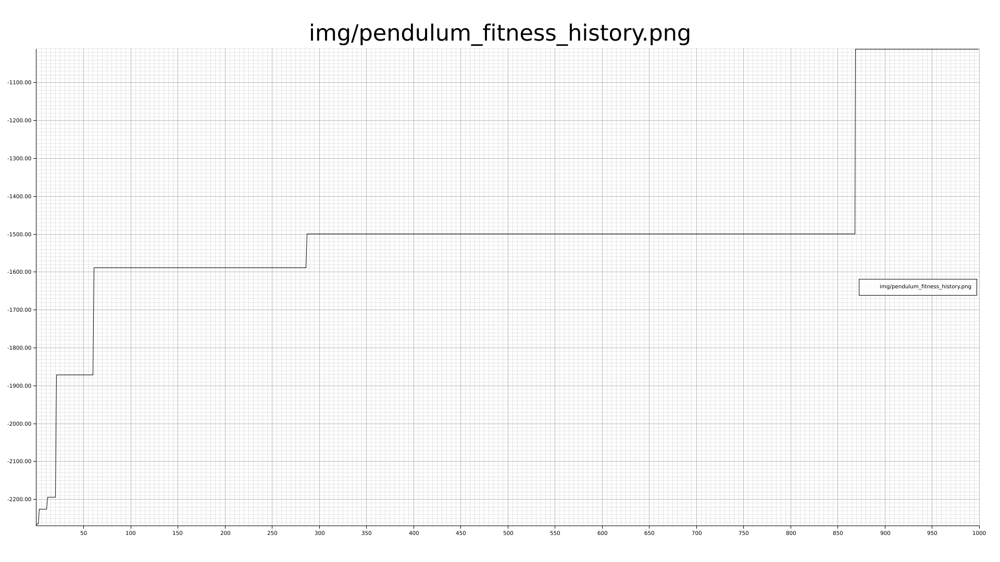

# CoSyNE
Cooperative Synapse Neuro Evolution in Rust

### Demonstration





Run examples like this:
```shell
RUST_LOG=info cargo run --example cart_pole --release --features="gym-rs plot"
RUST_LOG=info cargo run --example pendulum --release --features="gym-rs plot"
```

### Features:
- User defined neural network topology using ANN struct
- Highly configurable using Config
- User defined activation function through Config
    - Linear
    - Threshold
    - Sign
    - Sigmoid
    - Tanh
    - SoftSign
    - BentIdentity
    - Relu
- Change some config options mid optimization (maybe to achieve simulated annealing)
    - set_mutation_prob(&mut self, mp: f64)
    - set_mutation_strength(&mut self, ms: f64)
    - set_perturb_prob(&mut self, pp: f64)

### How to use
To use this crate in your project, add the following to your Cargo.toml:
```toml
[dependencies]
cosyne = "0.3.2"
```

### Network Topology Creation
To create a user defined neural network topology, use ANN struct as such:
```rust
let num_input = 3;
let num_outputs = 1;
let mut nn = ANN::new(num_input, num_output, Activation::Relu);
nn.add_layer(5, Activation::Relu);
nn.add_layer(3, Activation::Relu);
```

### Plot feature
Enable the plot feature by passing --features="plot"
or in your Cargo.toml
```toml
cosyne = { version = "0.3.2", features="plot" }
```



## TODOS:
- user defined crossover type (multipoint vs singlepoint)
- User defined initial network randomization method
    - uniform
    - gaussian
    - poisson disk sampling
- allow for recurrent weights
- Expose mutation distribution to config
- safeguard public config fields with setter and assertions
- plot the ANN

### Donations :moneybag: :money_with_wings:
I you would like to support the development of this crate, feel free to send over a donation:

Monero (XMR) address:
```plain
47xMvxNKsCKMt2owkDuN1Bci2KMiqGrAFCQFSLijWLs49ua67222Wu3LZryyopDVPYgYmAnYkSZSz9ZW2buaDwdyKTWGwwb
```


### License
Copyright (C) 2020  <Mathis Wellmann wellmannmathis@gmail.com>

This program is free software: you can redistribute it and/or modify
it under the terms of the GNU General Public License as published by
the Free Software Foundation, either version 3 of the License, or
(at your option) any later version.

This program is distributed in the hope that it will be useful,
but WITHOUT ANY WARRANTY; without even the implied warranty of
MERCHANTABILITY or FITNESS FOR A PARTICULAR PURPOSE.  See the
GNU General Public License for more details.

You should have received a copy of the GNU General Public License
along with this program.  If not, see <https://www.gnu.org/licenses/>.
